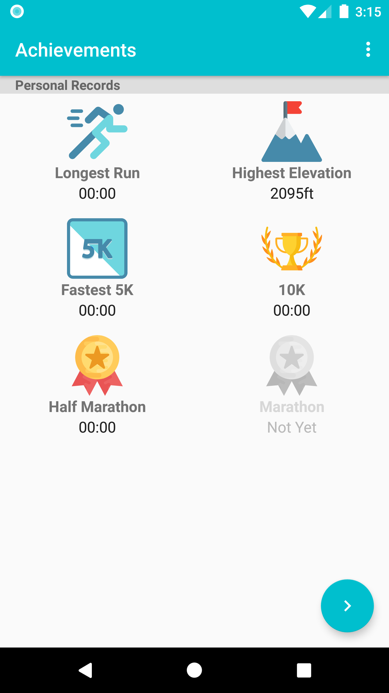
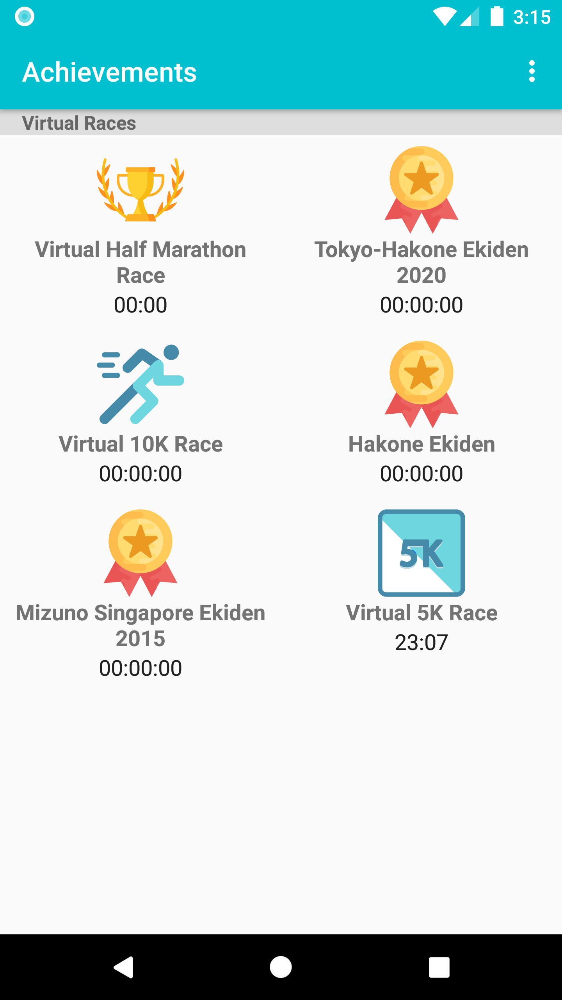
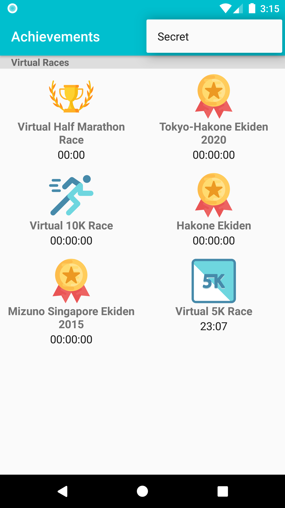

# RaceRoster/Runkeeper-TrophyUI

A simple UI to represent a user's trophy cabinet. Following assumptions were made inorder to complete this task:
  - The trophy cabinet is divided into categories
  - each category is presented in a seperate fragment (The image asked to mock indicated that)
  - No other functionaly to implement other than the UI

# Extra Features!

  - Instead of using a simple and boring view pager, I used the new Navigation Component.
  - Added a simple Espresso UI Test to check the functionalioty of the Navigation Component and show case espresso at a basic level.
  - A "Secret" hidden in the Options menu.
  - Technical: Used databinding to avoid redundant code in some parts of the app (to showcase diversity in implementation). Also it means that Android System only traverses the viwe hierarchy once (to get the views). 
  - Technical: Used the same fragment UI for both categories to avoid redundant code and yet achieved all differeing aspects of the 2 fragments (FAB and Category title).
  - technical: Used layout's that make the UI compatible with screen rotation.  

Future Steps (If I had more time):
  - Instead of hardcoding the list of achievements, I would rather use the ROOM database and livedata to store fetch and teh achievements list for each category.
  - Implement BDD (Behaviour Driven Development) to better present the UI Automated tests. 
  - Would have added a library to show Confetti when the user gets to the achievement page.
  - Suggestion: Maybe used Material Design suggested "CardView" instead of flat items in the RecyclerView.

### Screenshots:

  
